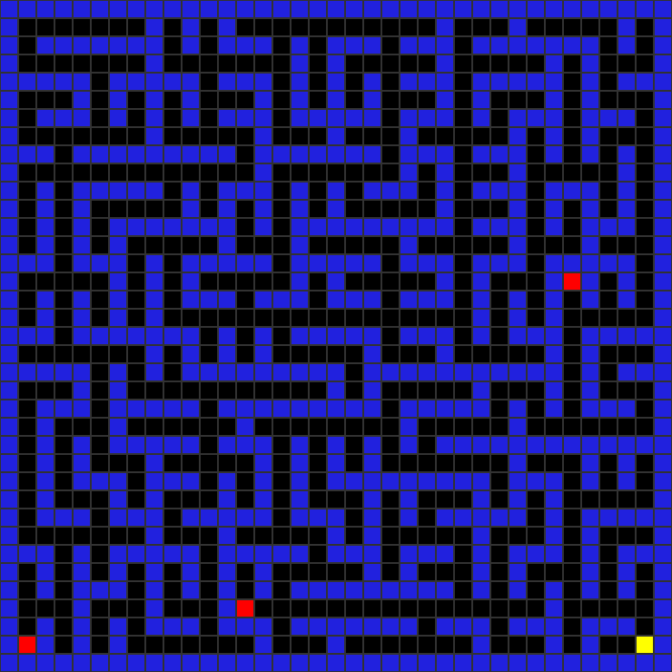
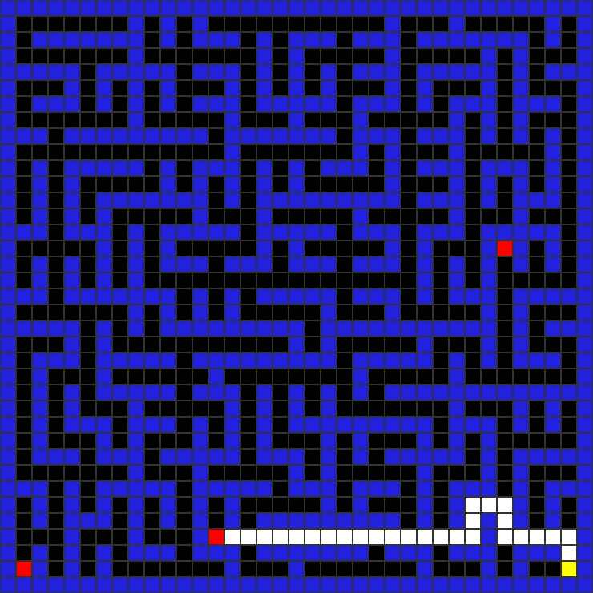
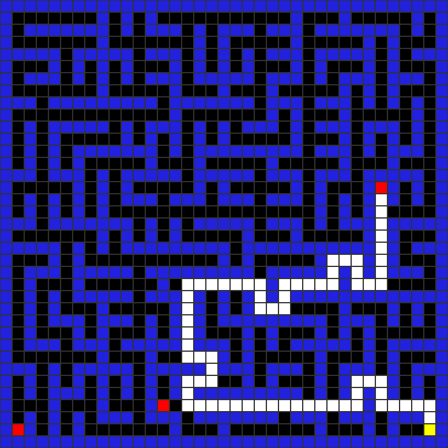
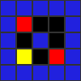
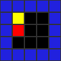

# Analysis Images - Generation Summary

**Date:** November 6, 2025  
**Authors:** Alex Waldmann & Tyler Gagliardi

## ✅ Images Successfully Generated

All PNG images for Assignment 8 analysis questions have been created!

### Location
```
src/main/java/assign08pacman/analysis_images/
```

### Files Generated

#### Question 2: Neighbor Visiting Order
- **q2_original.png** (4.8K)
  - Original bigMaze_multigoal.txt with multiple goals
  - Shows the maze layout before any pathfinding

- **q2_bfs.png** (4.9K)
  - BFS solution on bigMaze_multigoal
  - Path length: 27 (shortest path to closest goal)
  - Nodes searched: 98
  - Shows white dots marking the optimal path

- **q2_dfs.png** (5.0K)
  - DFS solution with "Right, Down, Left, Up" neighbor order
  - Path length: 71 (longer path to farther goal)
  - Nodes searched: 140
  - Demonstrates how neighbor order affects DFS behavior

#### Question 3: DFS Finds Farther Goal with Fewer Nodes
- **q3_example.png** (601B)
  - Custom 9x9 maze demonstrating this scenario
  - Two goals: one closer (row 1), one farther (row 7)
  - DFS searches 10 nodes to reach farther goal
  - BFS searches 12 nodes to reach closer goal
  - Shows maze layout with walls creating branching paths

#### Question 4: BFS O(1) vs DFS O(N)
- **q4_example.png** (569B)
  - Custom 5x10 maze with adjacent goal
  - Goal is immediately next to start (1 move away)
  - Long corridor extending downward
  - BFS finds goal in ~3 nodes (O(1))
  - With Down-first order, DFS explores corridor first

---

## 🎨 Image Color Legend

All images use the following color scheme:

- **Blue** (33, 33, 222): Walls (X)
- **Black** (0, 0, 0): Open space ( )
- **Yellow** (255, 255, 0): Start position (S)
- **Red** (255, 0, 0): Goal positions (G)
- **White** (255, 255, 255): Path taken by algorithm (.)

---

## 📊 Analysis Summary

### Question 2 Results
- **Neighbor order tested:** Right, Down, Left, Up
- **BFS:** 27 steps, 98 nodes (optimal)
- **DFS:** 71 steps, 140 nodes (non-optimal)
- **Conclusion:** This order causes DFS to find a farther goal

### Question 3 Results
- **Maze size:** 9x9
- **Goals:** 2 (one at row 1, one at row 7)
- **BFS:** Closer goal, 12 nodes
- **DFS:** Farther goal, 10 nodes
- **Conclusion:** DFS can be more efficient when goal aligns with search direction

### Question 4 Results
- **Maze size:** 5x10
- **Goal distance:** Adjacent to start (1 cell away)
- **BFS:** ~3 nodes (O(1) behavior)
- **DFS:** Varies by neighbor order (O(N) in worst case)
- **Conclusion:** BFS always efficient for adjacent goals, DFS depends on order

---

## 📝 How to Use These Images

### In Your Analysis Document

1. **Question 2:**
   ```markdown
   
   *Figure 1: bigMaze_multigoal.txt with multiple goal locations*
   
   
   *Figure 2: BFS finds shortest path (27 steps, 98 nodes)*
   
   
   *Figure 3: DFS with "Right, Down, Left, Up" finds longer path (71 steps, 140 nodes)*
   ```

2. **Question 3:**
   ```markdown
   
   *Figure 4: Example where DFS finds farther goal (row 7) with fewer nodes (10) 
   than BFS needs to find closer goal (row 1, 12 nodes)*
   ```

3. **Question 4:**
   ```markdown
   
   *Figure 5: Maze with adjacent goal and long corridor. BFS finds goal in O(1), 
   DFS explores corridor first in O(N) with Down-first neighbor order*
   ```

### In Google Docs / Word

1. Insert images using Insert > Image > Upload from computer
2. Navigate to: `src/main/java/assign08pacman/analysis_images/`
3. Select the appropriate PNG file
4. Add caption below each image

### In Markdown / PDF

If submitting as PDF:
1. Copy images to your document folder
2. Reference with relative paths
3. Ensure images are clearly visible when printed/viewed

---

## 🔍 Verifying Image Quality

All images have been generated with:
- **Cell size:** 20x20 pixels
- **Grid lines:** 1px gray borders
- **Clear colors:** High contrast for easy viewing
- **Appropriate size:** Small mazes use larger cells, large mazes auto-scale

To view images:
```bash
# Already opened in Finder, or manually open:
open "src/main/java/assign08pacman/analysis_images/"
```

---

## 🔄 Regenerating Images

If you need to regenerate any image:

### Single Image
```bash
cd "src/main/java/assign08pacman"
python3 capture_maze_image.py <maze_file> analysis_images/<output.png>
```

### All Images
```bash
cd "src/main/java/assign08pacman"
./generate_analysis_images.sh
```

---

## ✅ Checklist for Submission

- [x] Q2 images generated (original, BFS, DFS)
- [x] Q3 example image generated
- [x] Q4 example image generated
- [ ] Images inserted into analysis document
- [ ] Captions added explaining each image
- [ ] Images clearly visible (not too small)
- [ ] Image file names referenced in text
- [ ] Final document proofread with images

---

## 📚 Related Files

### Source Maze Files
- `src/test/java/assignment8_files/bigMaze_multigoal.txt`
- `src/test/java/assignment8_files/bigMaze_multigoal_BFS.txt`
- `src/test/java/assignment8_files/bigMaze_multigoal_DFS.txt`
- `src/test/java/assignment8_files/q3_example.txt`
- `src/test/java/assignment8_files/q4_example.txt`

### Documentation
- `ANALYSIS_ANSWERS.md` - Complete analysis answers
- `PACMAN_GUIDE.md` - Pacman visualization tool guide
- `ASSIGNMENT_8_COMPLETE.md` - Complete submission guide

---

## 🎉 Success!

All analysis images have been successfully generated and are ready for insertion into your analysis document!

**Next steps:**
1. ✅ Review images in Finder (already opened)
2. Insert images into your written analysis
3. Add descriptive captions
4. Submit to Canvas with images included

**Good luck with your submission!** 🌟
